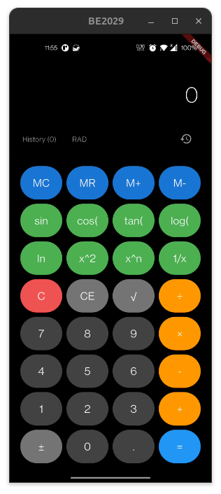

# Calculator

A simple calculator app built with Flutter.

## Table of Contents
- [Overview](#overview)
- [Getting Started](#getting-started)
- [Features](#features)
- [UI Screenshots](#ui-screenshots)
- [Resources](#resources)

## Overview
This project is a starting point for a Flutter application that demonstrates calculator logic, UI, and enhanced features. It is designed for learning and extending Flutter app development skills.

## Getting Started
To run this project locally:
1. Ensure you have [Flutter](https://flutter.dev/docs/get-started/install) installed.
2. Clone this repository.
3. Run `flutter pub get` to install dependencies.
4. Run `flutter run` to launch the app on your device or emulator.

## Features
- Basic arithmetic operations (addition, subtraction, multiplication, division)
- Responsive and modern UI
- Extensible logic for enhanced calculator features

## UI Screenshots

